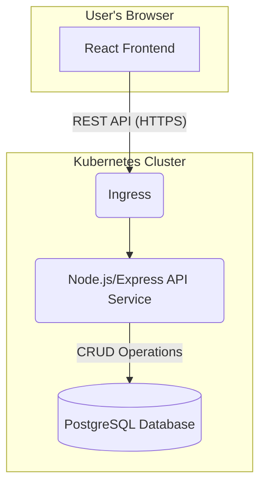
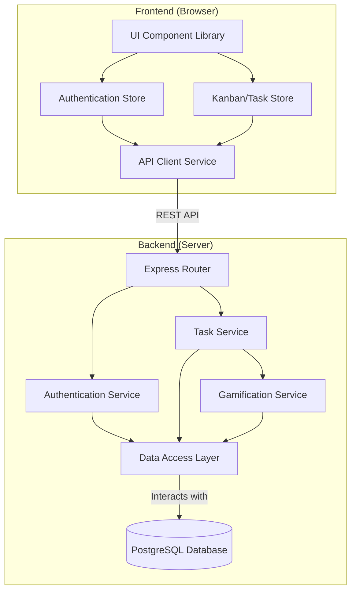
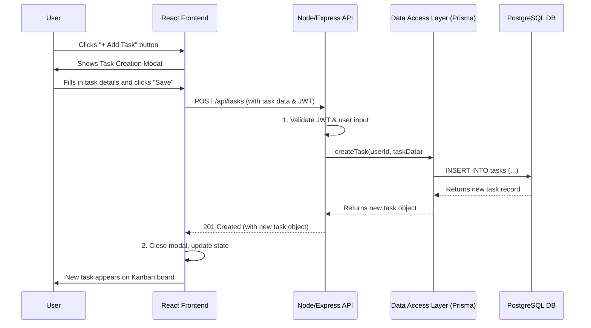
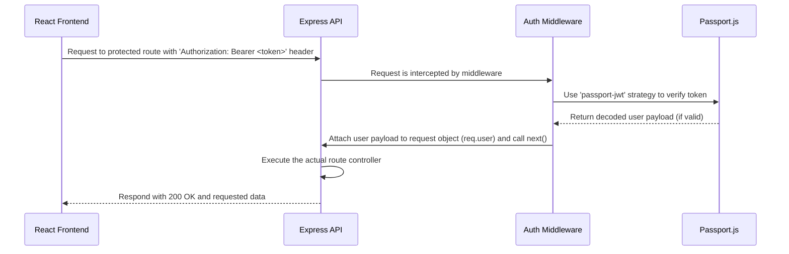
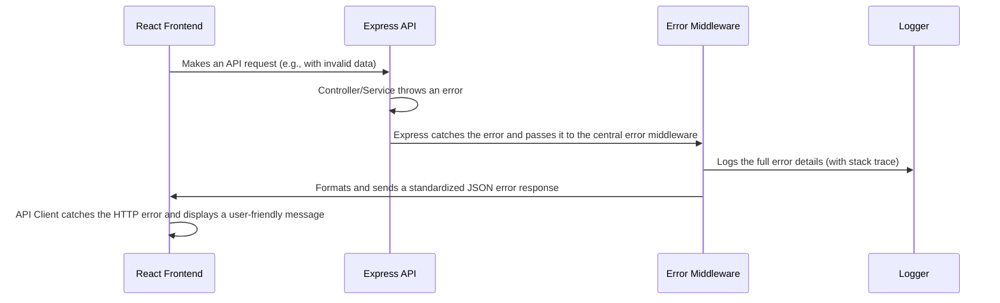

# Gamified To-Do List Fullstack Architecture Document

## Introduction

This document outlines the complete fullstack architecture for the Gamified To-Do List application, including backend systems, frontend implementation, and their integration. It serves as the single source of truth for all technical decisions, guiding the development agents.

### Starter Template or Existing Project

  * **Decision**: The project will be built from scratch with a **manual monorepo setup**.
  * **Rationale**: Per the user's request for a small project, a dedicated monorepo tool like Nx or Turborepo will not be used. Custom scripts will be required for managing workspaces and running tasks.

### Change Log

| Date | Version | Description | Author |
| :--- | :--- | :--- | :--- |
| 2025-10-06 | 1.0 | Initial architecture draft | Winston (Architect) |

-----

## High Level Architecture

### Technical Summary

This architecture describes a containerized, full-stack application built within a manually configured monorepo. The system features a responsive React frontend that communicates via a REST API with a monolithic Node.js/Express backend. All services, including a PostgreSQL database, will be containerized with Docker and are designed for deployment on a Kubernetes cluster. This pragmatic, monolithic approach is chosen to streamline development for the MVP while the container-based infrastructure ensures scalability and portability for the future.

### Platform and Infrastructure Choice

  * **Platform**: **Kubernetes (K8s)**. This provides a robust, cloud-agnostic platform for orchestrating our containerized services.
  * **Key Services**: To support this, we will rely on a managed Kubernetes service (like EKS, GKE, or AKS), a managed PostgreSQL database service, and a container registry.
  * **Deployment Regions**: A single region will be used for the MVP.

### Repository Structure

  * **Structure**: **Monorepo**.
  * **Monorepo Tool**: **None (Manual Setup)**.
  * **Package Organization**: The repository will contain separate `apps/api` and `apps/web` directories for the backend and frontend, and a `packages/` directory for any shared code (e.g., types).

### High Level Architecture Diagram



### Architectural Patterns

  * **Monolithic Architecture**: The backend will be a single, cohesive service. This simplifies development, testing, and deployment for the MVP.
  * **Monorepo**: A single repository will house all frontend, backend, and shared code.
  * **Component-Based UI**: The frontend will be built using reusable React components as defined in the UI/UX Specification.
  * **RESTful API**: A standard REST API will be used for all client-server communication.

-----

## Tech Stack

| Category | Technology | Version | Purpose | Rationale |
| :--- | :--- | :--- | :--- | :--- |
| **Frontend Language** | TypeScript | `~5.4.5` | Main language for frontend code | Provides type safety and scalability for React applications. |
| **Frontend Framework**| React | `~18.3.1` | UI library for building components | User's choice. Industry standard for building interactive UIs. |
| **UI Component Library**| Radix UI | `~1.0.0` | Headless components for accessibility | Aligns with the UI/UX spec's custom design goals, providing accessibility without imposing styles. |
| **State Management** | Zustand | `~4.5.2` | Lightweight global state management | A simple, modern alternative to Redux for managing state that needs to be shared across components. |
| **Backend Language** | TypeScript | `~5.4.5` | Main language for backend code | Ensures type safety and consistency with the frontend codebase. |
| **Backend Framework** | Express.js | `~4.19.2` | Web server framework for Node.js | User's choice. A minimal and flexible standard for building APIs. |
| **API Style** | REST | `N/A` | Client-server communication protocol | A well-understood and standard approach for web APIs. |
| **Database** | PostgreSQL | `16` | Relational database | User's choice. A powerful and reliable open-source SQL database. |
| **ORM** | Prisma | `~5.14.0` | Object-Relational Mapper | Provides a type-safe and modern way to interact with the PostgreSQL database from TypeScript. |
| **Authentication** | Passport.js | `~0.7.0` | Authentication middleware for Node.js | The de-facto standard for handling authentication in Express applications. |
| **Frontend Testing** | Jest & RTL | `~29.7.0` | Component and unit testing | Industry standard for testing React applications (React Testing Library). |
| **Backend Testing** | Jest & Supertest | `~29.7.0`| API and unit testing | Jest for the test runner and Supertest for making HTTP requests to the API. |
| **E2E Testing** | Playwright | `~1.44.0` | End-to-end browser testing | A modern and reliable tool for testing the application from a real user's perspective. |
| **Build Tool (FE)** | Vite | `~5.2.11` | Frontend build and dev server | Provides an extremely fast development experience and optimized builds for React. |
| **IaC Tool** | Helm | `~3.15.2` | Package manager for Kubernetes | Simplifies the process of defining, installing, and upgrading our application on Kubernetes. |
| **Logging** | Pino | `~9.1.0` | High-performance logger for Node.js | A fast and structured logger, essential for production environments. |
| **CSS Framework** | Tailwind CSS | `~3.4.3` | Utility-first CSS framework | The best choice for creating a custom "Airbnb-style" design without writing custom CSS from scratch. |

-----

## Data Models

### Data Model: User

**Purpose**: Represents a registered user of the application. This model stores authentication credentials and tracks the user's gamification score.
**Key Attributes**:

  * `id`: `UUID` - A unique identifier for the user.
  * `email`: `String` - The user's login email. Must be unique.
  * `passwordHash`: `String` - The securely hashed password. **This is never sent to the client.**
  * `score`: `Int` - The user's total gamification score. Defaults to `0`.
  * `createdAt`: `DateTime` - Timestamp of when the user account was created.
  * `updatedAt`: `DateTime` - Timestamp of the last update to the user account.
    **Relationships**: A **User** can have many **Tasks**.
    **TypeScript Interface (Shared)**:

<!-- end list -->

```typescript
interface User {
  id: string;
  email: string;
  score: number;
  createdAt: string; // ISO 8601 Date String
}
```

### Data Model: Task

**Purpose**: Represents a single to-do item created by a user.
**Key Attributes**:

  * `id`: `UUID` - A unique identifier for the task.
  * `title`: `String` - The main content/description of the task.
  * `status`: `String` (Enum: `TODO`, `IN_PROGRESS`, `DONE`) - The current status of the task.
  * `dueDate`: `DateTime` (Optional) - The date the task is due.
  * `userId`: `UUID` - A foreign key that links the task to the `User` who owns it.
  * `createdAt`: `DateTime` - Timestamp of when the task was created.
  * `updatedAt`: `DateTime` - Timestamp of the last update to the task.
    **Relationships**: A **Task** belongs to one **User**.
    **TypeScript Interface (Shared)**:

<!-- end list -->

```typescript
enum TaskStatus {
  TODO = 'TODO',
  IN_PROGRESS = 'IN_PROGRESS',
  DONE = 'DONE',
}

interface Task {
  id: string;
  title: string;
  status: TaskStatus;
  dueDate?: string | null; // Optional ISO 8601 Date String
  userId: string;
  createdAt: string; // ISO 8601 Date String
}
```

-----

## API Specification

```yaml
openapi: 3.0.0
info:
  title: Gamified To-Do List API
  version: 1.0.0
paths:
  /auth/signup:
    post:
      summary: Register a new user
      security: []
      # ... (details omitted for brevity) ...
  /auth/login:
    post:
      summary: Log in a user
      security: []
      # ... (details omitted for brevity) ...
  /tasks:
    get:
      summary: Get all tasks for the logged-in user
      # ... (details omitted for brevity) ...
    post:
      summary: Create a new task
      # ... (details omitted for brevity) ...
  /tasks/{taskId}:
    put:
      summary: Update a task's status
      # ... (details omitted for brevity) ...
# Full spec content from previous turn would be here
```

-----

## Components

### **Backend Components**

  * **Authentication Service**:
      * **Responsibility**: Handles all logic related to user registration, login, password hashing, and JWT generation/validation.
      * **Key Interfaces**: Exposes functions like `signUp(email, password)` and `logIn(email, password)`.
  * **Task Service**:
      * **Responsibility**: Manages all business logic for tasks: creation, retrieval, status updates, and ensuring tasks are tied to the correct user.
      * **Key Interfaces**: Exposes functions like `createTask(userId, taskData)`, `getTasksForUser(userId)`, `updateTaskStatus(userId, taskId, newStatus)`.
  * **Gamification Service**:
      * **Responsibility**: Contains the logic for the points system. It's called by the Task Service when a task is completed.
      * **Key Interfaces**: Exposes a function like `awardPointsForTaskCompletion(userId)`.
  * **Data Access Layer (DAL)**:
      * **Responsibility**: Abstract all database interactions using the Prisma ORM. This is the only component that directly communicates with the PostgreSQL database.
      * **Key Interfaces**: Exposes repository-pattern methods like `user.create()`, `task.findMany()`, `task.update()`.

### **Frontend Components**

  * **API Client Service**:
      * **Responsibility**: A dedicated, singleton module responsible for making all HTTP requests to the backend API. It will handle adding the JWT to headers and processing responses.
  * **Authentication Store**:
      * **Responsibility**: A global state store (using Zustand) that manages the user's authentication status, JWT, and user profile information.
  * **Kanban/Task Store**:
      * **Responsibility**: A global state store that manages the state of the tasks on the Kanban board, including fetching, adding, and updating them.
  * **UI Component Library**:
      * **Responsibility**: The set of reusable, presentational React components (Button, Task Card, Modal, etc.) that form the visual part of the application.

### **Component Interaction Diagram**



## External APIs

## Skipped for the MVP as no external API integrations are required.

## Core Workflows

### Workflow: Create a New Task

This diagram shows the end-to-end sequence when a user creates a new task.



## Database Schema

```sql
-- Enable UUID generation function if not already enabled
CREATE EXTENSION IF NOT EXISTS "uuid-ossp";

-- Create the users table
CREATE TABLE "users" (
    "id" UUID PRIMARY KEY DEFAULT uuid_generate_v4(),
    "email" VARCHAR(255) UNIQUE NOT NULL,
    "password_hash" TEXT NOT NULL,
    "score" INTEGER NOT NULL DEFAULT 0,
    "created_at" TIMESTAMPTZ NOT NULL DEFAULT NOW(),
    "updated_at" TIMESTAMPTZ NOT NULL DEFAULT NOW()
);

-- Create the tasks table
CREATE TABLE "tasks" (
    "id" UUID PRIMARY KEY DEFAULT uuid_generate_v4(),
    "title" VARCHAR(255) NOT NULL,
    "status" VARCHAR(50) NOT NULL DEFAULT 'TODO' CHECK ("status" IN ('TODO', 'IN_PROGRESS', 'DONE')),
    "due_date" TIMESTAMPTZ NULL,
    "user_id" UUID NOT NULL REFERENCES "users"("id") ON DELETE CASCADE,
    "created_at" TIMESTAMPTZ NOT NULL DEFAULT NOW(),
    "updated_at" TIMESTAMPTZ NOT NULL DEFAULT NOW()
);

-- Create indexes for performance optimization
CREATE INDEX "idx_tasks_user_id" ON "tasks"("user_id");
CREATE INDEX "idx_tasks_status" ON "tasks"("status");
```

-----

## Frontend Architecture

### **Component Architecture**

This defines how we'll structure our React components to keep the codebase organized, maintainable, and easy to work with.

#### **Component Organization**

We will use a feature-based folder structure. All files related to a specific feature will be co-located within a single folder. Reusable, shared components will live in a separate top-level `components` directory.

```
apps/web/src/
├── components/         # Shared, reusable UI components (e.g., Button, Modal)
│   ├── Button/
│   │   ├── Button.tsx
│   │   └── Button.test.tsx
│   └── ...
├── features/           # Feature-based modules
│   ├── Authentication/
│   │   └── components/
│   │       └── LoginForm.tsx
│   └── KanbanBoard/
│       └── components/
│           ├── KanbanBoard.tsx
│           ├── KanbanColumn.tsx
│           └── TaskCard.tsx
└── ...
```

#### **Component Template**

All new React components must follow this functional component template using TypeScript.

```typescript
import React from 'react';

// Define the component's props with TypeScript
interface MyComponentProps {
  title: string;
  onPress: () => void;
}

export const MyComponent: React.FC<MyComponentProps> = ({ title, onPress }) => {
  return (
    <div className="p-4 border rounded-lg">
      <h3 className="text-lg font-bold">{title}</h3>
      <button
        onClick={onPress}
        className="px-4 py-2 mt-2 text-white bg-primary-500 rounded-md"
      >
        Click Me
      </button>
    </div>
  );
};
```

### **State Management Architecture**

This is how we'll manage data that needs to be shared across different components in our application. We'll use **Zustand**.

#### **Store Structure**

We will co-locate all our Zustand state stores in a dedicated `store` directory.

```
apps/web/src/
├── store/
│   ├── authStore.ts
│   ├── taskStore.ts
│   └── index.ts
└── ... (other folders)
```

#### **State Management Patterns**

Each store will follow a standard pattern including state, actions, and computed values.

```typescript
import { create } from 'zustand';

// Define the shape of the store's state and actions
interface AuthState {
  user: User | null;
  token: string | null;
  isAuthenticated: () => boolean; // A computed value
  login: (user: User, token: string) => void;
  logout: () => void;
}

export const useAuthStore = create<AuthState>((set, get) => ({
  // Initial State
  user: null,
  token: null,

  // Computed Value
  isAuthenticated: () => !!get().token,

  // Action
  login: (user, token) => {
    set({ user, token });
  },

  // Action
  logout: () => {
    set({ user: null, token: null });
  },
}));
```

### **Routing Architecture**

This defines how users navigate between pages and how we protect certain pages.

#### **Route Organization**

```
apps/web/src/
├── pages/              # Contains the top-level component for each page
│   ├── DashboardPage.tsx
│   ├── LoginPage.tsx
│   └── ...
├── routes/
│   └── index.tsx       # Central file to define all application routes
└── ...
```

#### **Protected Route Pattern**

```typescript
import React from 'react';
import { Navigate, Outlet } from 'react-router-dom';
import { useAuthStore } from '../store/authStore';

export const ProtectedRoute: React.FC = () => {
  const isAuthenticated = useAuthStore((state) => state.isAuthenticated());

  if (!isAuthenticated) {
    return <Navigate to="/login" replace />;
  }

  return <Outlet />; // Renders the child route element
};
```

### **Frontend Services Layer**

This is the dedicated part of our code responsible for all communication with the backend API.

#### **API Client Setup**

We will create a single, centralized `axios` instance with an "interceptor" that automatically attaches the user's authentication token to every request.

```typescript
// Located at: apps/web/src/lib/apiClient.ts
import axios from 'axios';
import { useAuthStore } from '../store/authStore';

const apiClient = axios.create({
  baseURL: '/api',
});

apiClient.interceptors.request.use(
  (config) => {
    const token = useAuthStore.getState().token;
    if (token) {
      config.headers.Authorization = `Bearer ${token}`;
    }
    return config;
  },
  (error) => Promise.reject(error)
);

export default apiClient;
```

#### **Service Example**

```typescript
// Located at: apps/web/src/features/KanbanBoard/services/taskService.ts
import apiClient from '../../../lib/apiClient';

const taskService = {
  getAll: async (): Promise<Task[]> => {
    const response = await apiClient.get('/tasks');
    return response.data;
  },
  // ... other functions
};

export default taskService;
```

-----

## Backend Architecture

### **Service Architecture**

This defines our folder structure and provides a template for creating our API routes and controllers.

#### **Controller/Route Organization**

```
apps/api/src/
├── features/           # Feature-based modules
│   ├── auth/
│   │   ├── auth.controller.ts
│   │   ├── auth.service.ts
│   │   └── auth.routes.ts
│   └── tasks/
│       ├── tasks.controller.ts
│       ├── tasks.service.ts      # Business logic
│       ├── tasks.repository.ts   # Database logic (using Prisma)
│       └── tasks.routes.ts
├── middleware/         # Shared middleware (e.g., auth, error handling)
└── server.ts           # Main Express server setup file
```

#### **Controller Template**

```typescript
import { Request, Response, NextFunction } from 'express';
import { TaskService } from './tasks.service';

export class TaskController {
  constructor(private taskService: TaskService) {}

  public getAllTasks = async (req: Request, res: Response, next: NextFunction): Promise<void> => {
    try {
      const userId = (req as any).user.id;
      const tasks = await this.taskService.getTasksForUser(userId);
      res.status(200).json(tasks);
    } catch (error) {
      next(error); // Pass errors to a central error handler
    }
  };
}
```

### **Database Architecture**

#### **Schema Design**

The database schema will be the exact PostgreSQL DDL we defined and approved in the main **"Database Schema"** section of this document.

#### **Data Access Layer**

We will implement the **Repository Pattern**. Our business logic (Services) will not use the Prisma client directly.

```typescript
// Located at: apps/api/src/features/tasks/tasks.repository.ts
import { PrismaClient } from '@prisma/client';

const prisma = new PrismaClient();

export class TaskRepository {
  public async findByUserId(userId: string): Promise<Task[]> {
    return prisma.task.findMany({
      where: { userId },
      orderBy: { createdAt: 'desc' },
    });
  }
  // ... other functions
}
```

### **Authentication and Authorization**

#### **Authentication Flow (JWT)**



#### **Authentication Middleware**

```typescript
// Located at: apps/api/src/middleware/auth.middleware.ts
import { Request, Response, NextFunction } from 'express';
import passport from 'passport';

export const authMiddleware = (req: Request, res: Response, next: NextFunction) => {
  passport.authenticate('jwt', { session: false }, (err, user, info) => {
    if (err || !user) {
      return res.status(401).json({ message: 'Unauthorized' });
    }
    req.user = user;
    next();
  })(req, res, next);
};
```

-----

## Unified Project Structure

### **Corrected Folder and File Structure**

```plaintext
gamified-todo-app/
├── apps/
│   ├── api/
│   │   ├── src/
│   │   ├── Dockerfile.dev
│   │   └── package.json
│   └── web/
│       ├── src/
│       ├── Dockerfile.dev
│       └── package.json
├── packages/
│   └── shared/
├── infrastructure/
│   └── kubernetes/
├── scripts/
│   ├── build.sh
│   └── dev.sh
├── docs/
├── .dockerignore
├── docker-compose.yml
├── package.json
└── README.md
```

-----

## Development Workflow

### **Local Development Setup**

#### **Prerequisites**

  * Git
  * Node.js (for package management)
  * Docker & Docker Compose

#### **Initial Setup**

```bash
# 1. Clone the repository
git clone <repository_url>
cd gamified-todo-app

# 2. Build the Docker images
docker-compose build
```

#### **Development Commands**

```bash
# Start all services in the background
docker-compose up -d

# Stop all running services
docker-compose down

# View logs from all services
docker-compose logs -f
```

-----

## Deployment Architecture

### **Deployment Strategy**

  * **Frontend Deployment**: Static React assets will be served from a lightweight **Nginx** container running within our Kubernetes cluster.
  * **Backend Deployment**: The Node.js/Express API will run as a **Node.js** container within our Kubernetes cluster.

### **CI/CD Pipeline (Example: GitHub Actions)**

```yaml
name: CI/CD Pipeline
on:
  push:
    branches: [ main ]
jobs:
  test-and-build:
    name: Test and Build Images
    runs-on: ubuntu-latest
    steps:
      - name: Checkout Code
      - name: Install Dependencies & Run Tests
      - name: Build and Push Docker Images
  deploy:
    name: Deploy to Kubernetes
    needs: test-and-build
    runs-on: ubuntu-latest
    steps:
      - name: Checkout Code
      - name: Configure Kubernetes Credentials
      - name: Deploy Application using Helm
```

### **Environments**

| Environment | Frontend URL | Backend URL | Purpose |
| :--- | :--- | :--- | :--- |
| **Development** | `http://localhost:3000` | `http://localhost:3001` | Local development via Docker Compose. |
| **Staging** | `https://staging.yourapp.com` | `https://api-staging.yourapp.com` | Pre-release testing. |
| **Production** | `https://www.yourapp.com` | `https://api.yourapp.com` | The live environment. |

-----

## Security and Performance

### **Security Requirements**

  * **Frontend Security**:
      * **Content Security Policy (CSP)**: A strict CSP will be implemented to prevent Cross-Site Scripting (XSS) attacks.
      * **XSS Prevention**: We will rely on React's native data binding to automatically sanitize content rendered in the UI.
      * **Secure Storage**: Authentication tokens (JWTs) will be stored in secure, `HttpOnly` cookies to prevent them from being accessed by client-side scripts.
  * **Backend Security**:
      * **Input Validation**: All incoming data from users (request bodies, params, queries) will be strictly validated on the backend using a library like `zod`.
      * **Rate Limiting**: The API will have rate limiting enabled to prevent brute-force and Denial-of-Service (DoS) attacks.
      * **CORS Policy**: The Cross-Origin Resource Sharing policy will be configured to only allow requests from our known frontend domain.
  * **Authentication Security**:
      * **Password Policy**: Passwords will be hashed using a strong, salted algorithm (e.g., bcrypt).
      * **Session Management**: We will use stateless JWTs with a short expiration time for user sessions.

### **Performance Optimization**

  * **Frontend Performance**:
      * **Bundle Size Target**: The initial JavaScript bundle for the main page should be under 500KB (gzipped).
      * **Loading Strategy**: We will use route-based code-splitting and lazy-load components where appropriate.
      * **Caching Strategy**: Static assets will be configured for aggressive browser caching.
  * **Backend Performance**:
      * **Response Time Target**: The 95th percentile (p95) response time for all core API endpoints should be under 200ms.
      * **Database Optimization**: We will leverage the database indexes defined in our schema and use connection pooling.
      * **Caching Strategy**: Post-MVP, a caching layer (e.g., Redis) can be introduced for frequently accessed, non-critical data.

-----

## Testing Strategy

### **Testing Pyramid**

```
      /-----------\
     /   E2E Tests   \
    /-----------------\
   / Integration Tests \
  /---------------------\
 /  Unit Tests (FE & BE) \
/-----------------------\
```

### **Test Organization**

#### **Frontend Tests (`apps/web`)**

```
apps/web/src/
└── features/
    └── KanbanBoard/
        └── components/
            ├── TaskCard.tsx
            └── TaskCard.test.tsx  <-- Test file co-located with component
```

#### **Backend Tests (`apps/api`)**

```
apps/api/src/
└── features/
    └── tasks/
        ├── __tests__/
        │   ├── tasks.service.test.ts
        │   └── tasks.routes.test.ts
        ├── tasks.controller.ts
        └── tasks.service.ts
```

#### **E2E Tests (Root)**

```
gamified-todo-app/
└── e2e/
    ├── login.spec.ts
    └── tasks.spec.ts
```

### **Test Examples**

#### **Frontend Component Test (Jest & React Testing Library)**

```typescript
import { render, screen } from '@testing-library/react';
import { TaskCard } from './TaskCard';

test('renders task title correctly', () => {
  const task = { id: '1', title: 'Test My Component', status: 'TODO' };
  render(<TaskCard task={task} />);
  const titleElement = screen.getByText(/Test My Component/i);
  expect(titleElement).toBeInTheDocument();
});
```

#### **Backend API Test (Jest & Supertest)**

```typescript
import request from 'supertest';
import app from '../../server';

describe('GET /api/tasks', () => {
  it('should respond with 401 Unauthorized if no token is provided', async () => {
    const response = await request(app).get('/api/tasks');
    expect(response.statusCode).toBe(401);
  });
});
```

#### **E2E Test (Playwright)**

```typescript
import { test, expect } from '@playwright/test';

test('user can log in and see the dashboard', async ({ page }) => {
  await page.goto('/login');
  await page.fill('input[type="email"]', 'test@example.com');
  await page.fill('input[type="password"]', 'password123');
  await page.click('button[type="submit"]');

  await expect(page).toHaveURL('/dashboard');
  await expect(page.locator('h1')).toHaveText('My Tasks');
});
```

-----

## Coding Standards

### **Critical Fullstack Rules**

1.  **Type Sharing**: All shared data structures (e.g., `User`, `Task` types) **must** be defined in the `packages/shared` directory and imported by both the frontend and backend. Never redefine these types.
2.  **API Client Usage**: The frontend application **must never** make direct HTTP calls (`fetch`, `axios`) from components. All API communication **must** go through the functions defined in the `API Client Service` layer.
3.  **State Management**: For any state that is shared between multiple components, the frontend **must** use the appropriate Zustand store (`authStore`, `taskStore`).
4.  **Environment Variables**: Code **must not** access environment variables directly using `process.env`. A dedicated, typed configuration object must be used.
5.  **Backend Separation of Concerns**: Backend logic **must** be separated as follows: Routes -\> Controllers -\> Services -\> Repositories.

### **Naming Conventions**

| Element | Frontend | Backend | Example |
| :--- | :--- | :--- | :--- |
| **Components** | `PascalCase` | - | `TaskCard.tsx` |
| **Hooks** | `useCamelCase`| - | `useAuth.ts` |
| **API Routes** | - | `kebab-case`| `/user-profile` |
| **Database Tables**| - | `snake_case` | `user_profiles` |

-----

## Error Handling Strategy

### **Error Flow**



### **Standardized Error Response Format**

```typescript
interface ApiError {
  error: {
    message: string;        // A user-friendly error message
    code?: string;          // An optional, machine-readable error code
    details?: Record<string, any>; // Optional, for field-specific validation errors
    requestId: string;      // A unique ID to correlate logs
  };
}
```

### **Frontend Error Handling (in API Client)**

```typescript
// In apiClient.ts
apiClient.interceptors.response.use(
  (response) => response,
  (error) => {
    const errorMessage = error.response?.data?.error?.message || 'An unexpected error occurred.';
    // A toast library would be used here to show the user the error.
    console.error('API Error:', errorMessage);
    return Promise.reject(error);
  }
);
```

### **Backend Error Handling (in Express)**

```typescript
// In a central error.middleware.ts
import { Request, Response, NextFunction } from 'express';

export const errorMiddleware = (error: Error, req: Request, res: Response, next: NextFunction) => {
  console.error(error); // The logger (Pino) would be used here in production
  const response: ApiError = {
    error: {
      message: error.message || 'Internal Server Error',
      requestId: (req as any).id,
    },
  };
  res.status(500).json(response);
};
```

-----

## Monitoring and Observability

### **Monitoring Stack**

  * **Frontend Monitoring**: **Sentry** to capture JavaScript errors and monitor Core Web Vitals.
  * **Backend Monitoring**: **Prometheus** for metrics collection and **Grafana** for dashboards.
  * **Error Tracking**: **Sentry** will be used for both frontend and backend for unified error aggregation and alerting.
  * **Logging**: The backend will output structured JSON logs, which will be collected by **Fluentd** or **Loki** in the Kubernetes cluster.

### **Key Metrics to Track**

  * **Frontend Metrics**:
      * Core Web Vitals (LCP, FID, CLS)
      * JavaScript error rate
      * API request latency (client-side)
  * **Backend Metrics**:
      * API Request Rate (requests per second)
      * API Error Rate (% of 4xx and 5xx responses)
      * API Latency (p95 and p99 response times)
      * Database query performance

