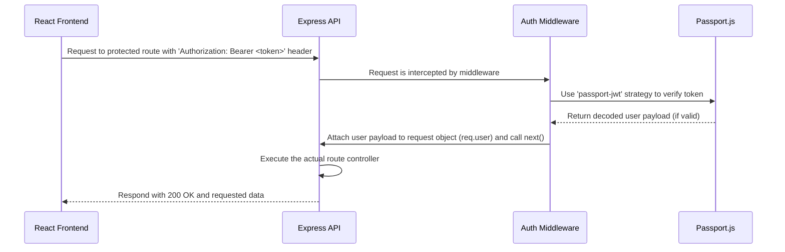

# Backend Architecture

## **Service Architecture**

This defines our folder structure and provides a template for creating our API routes and controllers.

### **Controller/Route Organization**

```
apps/api/src/
├── features/           # Feature-based modules
│   ├── auth/
│   │   ├── auth.controller.ts
│   │   ├── auth.service.ts
│   │   └── auth.routes.ts
│   └── tasks/
│       ├── tasks.controller.ts
│       ├── tasks.service.ts      # Business logic
│       ├── tasks.repository.ts   # Database logic (using Prisma)
│       └── tasks.routes.ts
├── middleware/         # Shared middleware (e.g., auth, error handling)
└── server.ts           # Main Express server setup file
```

### **Controller Template**

```typescript
import { Request, Response, NextFunction } from 'express';
import { TaskService } from './tasks.service';

export class TaskController {
  constructor(private taskService: TaskService) {}

  public getAllTasks = async (req: Request, res: Response, next: NextFunction): Promise<void> => {
    try {
      const userId = (req as any).user.id;
      const tasks = await this.taskService.getTasksForUser(userId);
      res.status(200).json(tasks);
    } catch (error) {
      next(error); // Pass errors to a central error handler
    }
  };
}
```

## **Database Architecture**

### **Schema Design**

The database schema will be the exact PostgreSQL DDL we defined and approved in the main **"Database Schema"** section of this document.

### **Data Access Layer**

We will implement the **Repository Pattern**. Our business logic (Services) will not use the Prisma client directly.

```typescript
// Located at: apps/api/src/features/tasks/tasks.repository.ts
import { PrismaClient } from '@prisma/client';

const prisma = new PrismaClient();

export class TaskRepository {
  public async findByUserId(userId: string): Promise<Task[]> {
    return prisma.task.findMany({
      where: { userId },
      orderBy: { createdAt: 'desc' },
    });
  }
  // ... other functions
}
```

## **Authentication and Authorization**

### **Authentication Flow (JWT)**



### **Authentication Middleware**

```typescript
// Located at: apps/api/src/middleware/auth.middleware.ts
import { Request, Response, NextFunction } from 'express';
import passport from 'passport';

export const authMiddleware = (req: Request, res: Response, next: NextFunction) => {
  passport.authenticate('jwt', { session: false }, (err, user, info) => {
    if (err || !user) {
      return res.status(401).json({ message: 'Unauthorized' });
    }
    req.user = user;
    next();
  })(req, res, next);
};
```

-----
