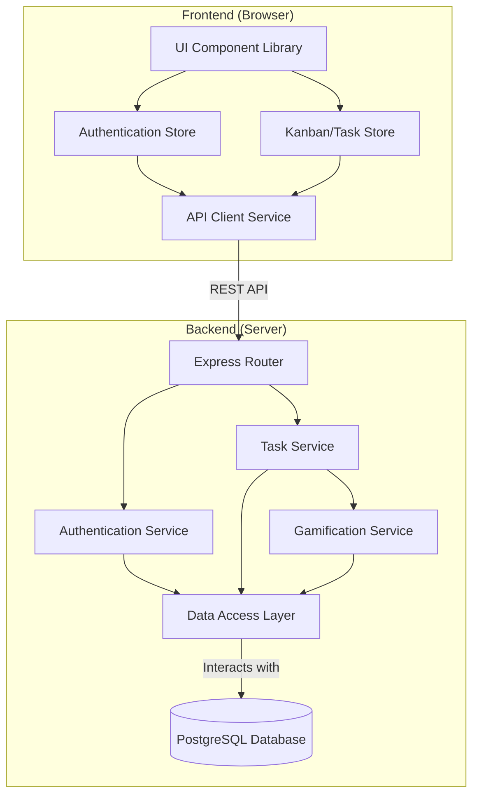

# Components

## **Backend Components**

  * **Authentication Service**:
      * **Responsibility**: Handles all logic related to user registration, login, password hashing, and JWT generation/validation.
      * **Key Interfaces**: Exposes functions like `signUp(email, password)` and `logIn(email, password)`.
  * **Task Service**:
      * **Responsibility**: Manages all business logic for tasks: creation, retrieval, status updates, and ensuring tasks are tied to the correct user.
      * **Key Interfaces**: Exposes functions like `createTask(userId, taskData)`, `getTasksForUser(userId)`, `updateTaskStatus(userId, taskId, newStatus)`.
  * **Gamification Service**:
      * **Responsibility**: Contains the logic for the points system. It's called by the Task Service when a task is completed.
      * **Key Interfaces**: Exposes a function like `awardPointsForTaskCompletion(userId)`.
  * **Data Access Layer (DAL)**:
      * **Responsibility**: Abstract all database interactions using the Prisma ORM. This is the only component that directly communicates with the PostgreSQL database.
      * **Key Interfaces**: Exposes repository-pattern methods like `user.create()`, `task.findMany()`, `task.update()`.

## **Frontend Components**

  * **API Client Service**:
      * **Responsibility**: A dedicated, singleton module responsible for making all HTTP requests to the backend API. It will handle adding the JWT to headers and processing responses.
  * **Authentication Store**:
      * **Responsibility**: A global state store (using Zustand) that manages the user's authentication status, JWT, and user profile information.
  * **Kanban/Task Store**:
      * **Responsibility**: A global state store that manages the state of the tasks on the Kanban board, including fetching, adding, and updating them.
  * **UI Component Library**:
      * **Responsibility**: The set of reusable, presentational React components (Button, Task Card, Modal, etc.) that form the visual part of the application.

## **Component Interaction Diagram**

