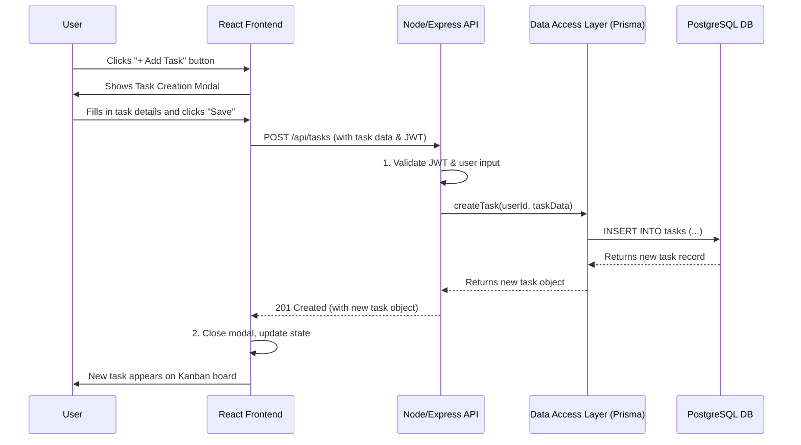

# Core Workflows

## Workflow: Create a New Task

This diagram shows the end-to-end sequence when a user creates a new task.

```mermaid
sequenceDiagram
    participant User
    participant ReactFrontend as React Frontend
    participant ExpressAPI as Node/Express API
    participant DAL as Data Access Layer (Prisma)
    participant Database as PostgreSQL DB

    User->>ReactFrontend: Clicks "+ Add Task" button
    ReactFrontend->>User: Shows Task Creation Modal
    User->>ReactFrontend: Fills in task details and clicks "Save"

    ReactFrontend->>ExpressAPI: POST /api/tasks (with task data & JWT)
    ExpressAPI->>ExpressAPI: 1. Validate JWT & user input
    ExpressAPI->>DAL: createTask(userId, taskData)
    DAL->>Database: INSERT INTO tasks (...)
    Database-->>DAL: Returns new task record
    DAL-->>ExpressAPI: Returns new task object
    ExpressAPI-->>ReactFrontend: 201 Created (with new task object)

    ReactFrontend->>ReactFrontend: 2. Close modal, update state
    ReactFrontend->>User: New task appears on Kanban board
```
