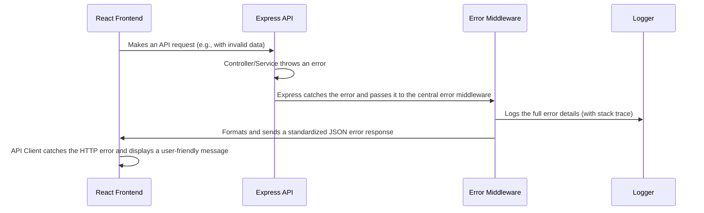

# Error Handling Strategy

## **Error Flow**



## **Standardized Error Response Format**

```typescript
interface ApiError {
  error: {
    message: string;        // A user-friendly error message
    code?: string;          // An optional, machine-readable error code
    details?: Record<string, any>; // Optional, for field-specific validation errors
    requestId: string;      // A unique ID to correlate logs
  };
}
```

## **Frontend Error Handling (in API Client)**

```typescript
// In apiClient.ts
apiClient.interceptors.response.use(
  (response) => response,
  (error) => {
    const errorMessage = error.response?.data?.error?.message || 'An unexpected error occurred.';
    // A toast library would be used here to show the user the error.
    console.error('API Error:', errorMessage);
    return Promise.reject(error);
  }
);
```

## **Backend Error Handling (in Express)**

```typescript
// In a central error.middleware.ts
import { Request, Response, NextFunction } from 'express';

export const errorMiddleware = (error: Error, req: Request, res: Response, next: NextFunction) => {
  console.error(error); // The logger (Pino) would be used here in production
  const response: ApiError = {
    error: {
      message: error.message || 'Internal Server Error',
      requestId: (req as any).id,
    },
  };
  res.status(500).json(response);
};
```

-----
