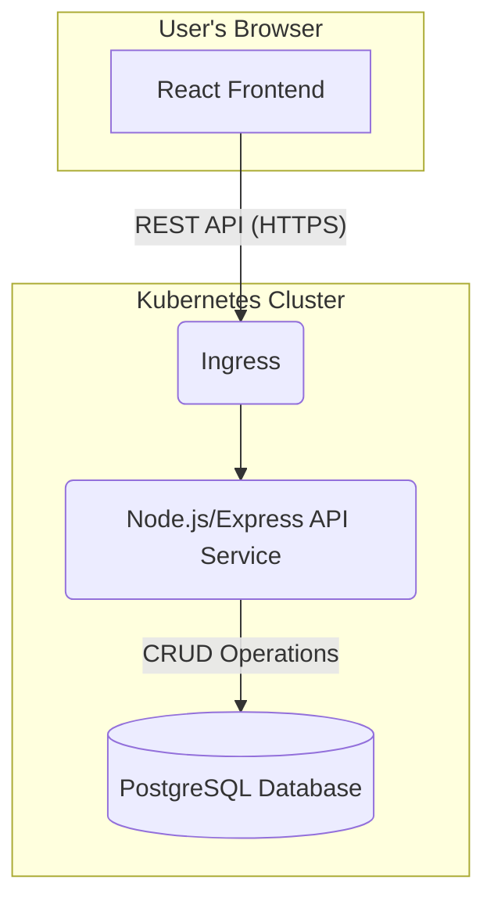

# High Level Architecture

## Technical Summary

This architecture describes a containerized, full-stack application built within a manually configured monorepo. The system features a responsive React frontend that communicates via a REST API with a monolithic Node.js/Express backend. All services, including a PostgreSQL database, will be containerized with Docker and are designed for deployment on a Kubernetes cluster. This pragmatic, monolithic approach is chosen to streamline development for the MVP while the container-based infrastructure ensures scalability and portability for the future.

## Platform and Infrastructure Choice

  * **Platform**: **Kubernetes (K8s)**. This provides a robust, cloud-agnostic platform for orchestrating our containerized services.
  * **Key Services**: To support this, we will rely on a managed Kubernetes service (like EKS, GKE, or AKS), a managed PostgreSQL database service, and a container registry.
  * **Deployment Regions**: A single region will be used for the MVP.

## Repository Structure

  * **Structure**: **Monorepo**.
  * **Monorepo Tool**: **None (Manual Setup)**.
  * **Package Organization**: The repository will contain separate `apps/api` and `apps/web` directories for the backend and frontend, and a `packages/` directory for any shared code (e.g., types).

## High Level Architecture Diagram

## Architectural Patterns

  * **Monolithic Architecture**: The backend will be a single, cohesive service. This simplifies development, testing, and deployment for the MVP.
  * **Monorepo**: A single repository will house all frontend, backend, and shared code.
  * **Component-Based UI**: The frontend will be built using reusable React components as defined in the UI/UX Specification.
  * **RESTful API**: A standard REST API will be used for all client-server communication.

-----
