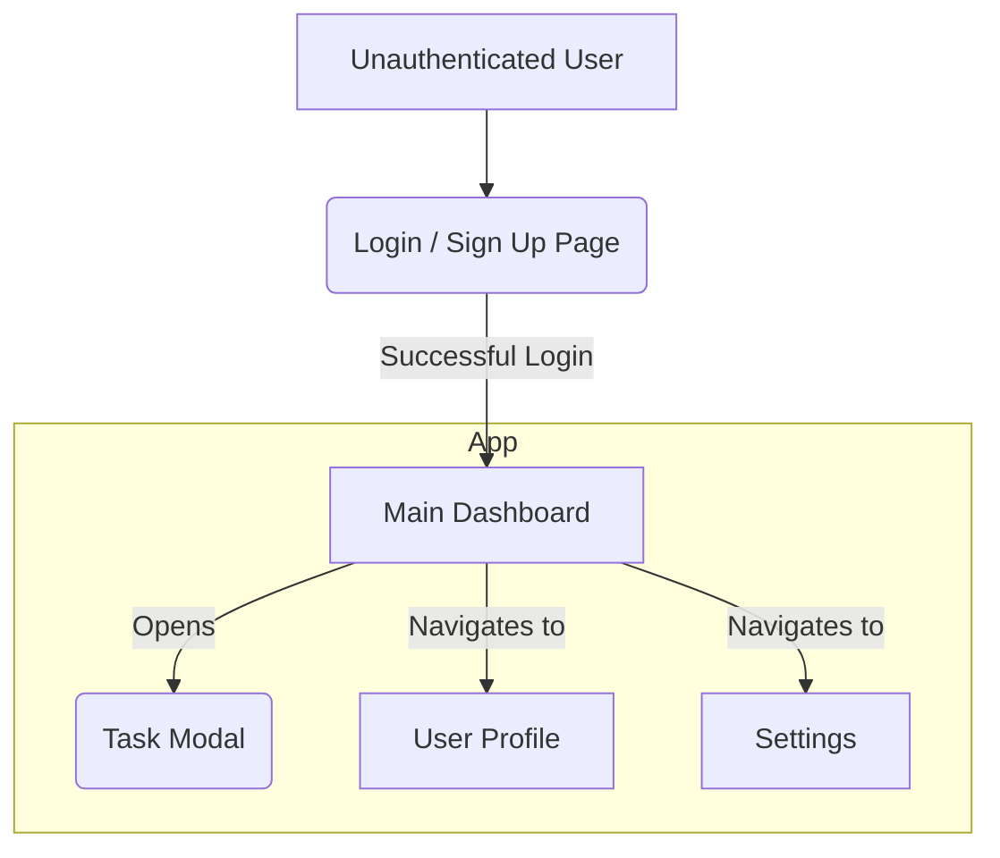
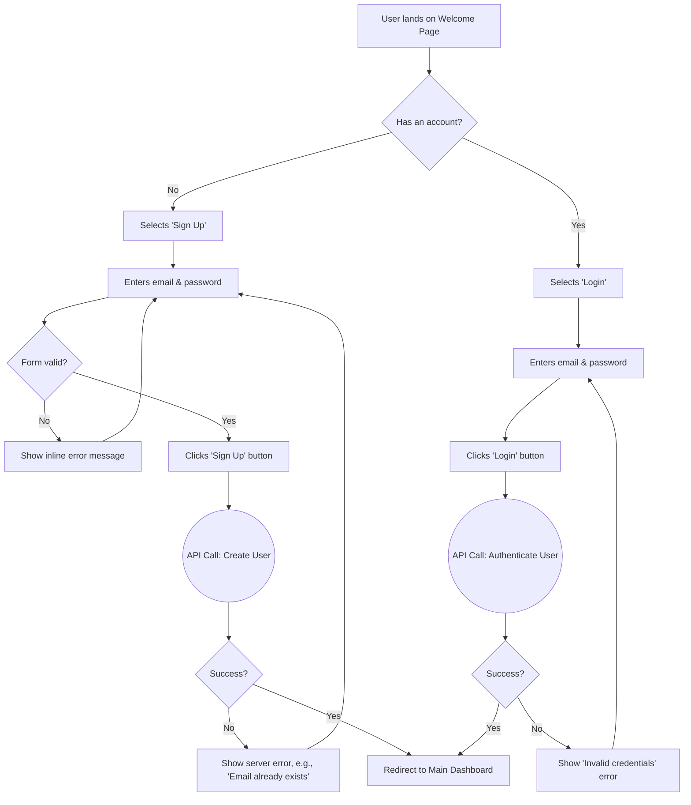
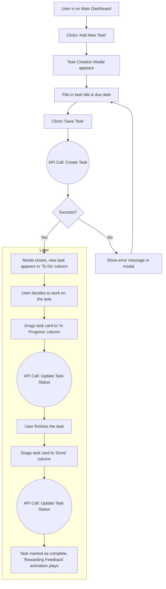

# Gamified To-Do List Application UI/UX Specification

## Introduction

This document defines the user experience goals, information architecture, user flows, and visual design specifications for the Gamified To-Do List Application's user interface. It serves as the foundation for visual design and frontend development, ensuring a cohesive and user-centered experience.

## Overall UX Goals & Principles

### Overall UX Vision

To create a user interface that is delightful, engaging, and motivating, inspired by the clean, modern, and trustworthy aesthetic of platforms like Airbnb. The experience should feel premium and intuitive, encouraging daily use through its elegance and efficiency.

### Usability Goals

  * **Ease of Learning**: A new user should be able to understand the core functionality and complete their first task within 3 minutes of signing up.
  * **Motivating Experience**: The application's design and feedback should make the user *want* to return daily to manage their tasks.
  * **Efficiency**: Once familiar, users should be able to add and organize tasks with minimal clicks and cognitive load.

### Design Principles

1.  **Clarity First**: The interface must be clean and intuitive. The aesthetic should enhance, not clutter, the core task management workflow.
2.  **Rewarding Feedback**: Every key action, especially task completion, must be met with immediate, smooth, and satisfying animations.
3.  **Visible Progress**: Users should always have a clear, at-a-glance view of their progress (score, streaks, etc.) to foster a sense of accomplishment.
4.  **Elegant & Efficient**: The aesthetic should be modern and sleek, ensuring the design is not only beautiful but also helps the user achieve their goals faster.

-----

## Information Architecture (IA)

### Site Map / Screen Inventory

This diagram shows the primary screens and the user's flow through the application for the MVP.



### Navigation Structure

  * **Primary Navigation**: After login, a persistent navigation bar (e.g., a header or sidebar) will be visible. It will contain links to the **Dashboard**, **User Profile**, and **Settings**. A **Logout** button will also be present.
  * **Secondary Navigation**: Not required for the MVP, as the initial application structure is relatively flat.
  * **Breadcrumb Strategy**: Not required for the MVP due to the simple hierarchy.

-----

## User Flows

### User Flow: User Onboarding (Sign Up & Login)

**User Goal**: To create a new account or access an existing one to start using the app.
**Entry Points**: Visiting the application's root URL for the first time.
**Success Criteria**: The user successfully creates an account or logs in and lands on the Main Dashboard, ready to manage their tasks.

**Flow Diagram**



**Edge Cases & Error Handling:**

  * User enters an email that is already registered during sign-up.
  * User enters an invalid email format or a weak password.
  * User enters incorrect credentials during login.
  * *Note: "Forgot Password" functionality is considered out of scope for the MVP but would be a critical addition in a future phase.*

### User Flow: Core Task Management (Create & Update)

**User Goal**: To add a new task to their list and easily update its status as they work on it.
**Entry Points**: The user is on the Main Dashboard.
**Success Criteria**: The user can successfully add a new task, see it appear on the board, and move it from 'To Do' to 'Done'.

**Flow Diagram**



**Edge Cases & Error Handling:**

  * User tries to create a task with a missing title.
  * An API error occurs when creating or updating a task (the card should revert to its original position).
  * User drops a task card outside of a valid column (the card should snap back to its origin).

-----

## Wireframes & Mockups

### Wireframe: Main Dashboard

**Purpose**: To provide the user with a clear, visual overview of their tasks and to make updating task status intuitive and easy via the Kanban board.

```
+--------------------------------------------------------------------------+
| HEADER (Sticky)                                                          |
|                                                                          |
| [Logo]  [Nav: Dashboard]                [Score: 1250 pts] [User Avatar]  |
+--------------------------------------------------------------------------+
|                                                                          |
|  My Tasks                                         [Button: + Add Task]   |
|                                                                          |
| +---------------------+  +---------------------+  +---------------------+ |
| | To Do (3)           |  | In Progress (1)     |  | Done (5)            | |
| +---------------------+  +---------------------+  +---------------------+ |
| |  [Task Card]        |  |  [Task Card]        |  |  [Task-Card-Done]   | |
| |   - Finish PRD      |  |   - Draft Wireframe |  |   - Set up project  | |
| |   - Due: Oct 8th    |  |   - Due: Today      |  |                     | |
| +---------------------+  +---------------------+  +---------------------+ |
| |  [Task Card]        |  |                     |  |  [Task-Card-Done]   | |
| |   - User Research   |  |                     |  |   - Onboard user    | |
| |   - Due: Oct 10th   |  |                     |  |                     | |
| +---------------------+  +---------------------+  +---------------------+ |
+--------------------------------------------------------------------------+
```

### Wireframe: Task Creation Modal

**Purpose**: To allow users to quickly add a new task without leaving the main dashboard context.

```
(Background: Main Dashboard - dimmed/blurred)

    +---------------------------------------------+
    |  Add a New Task                         [X] |
    +---------------------------------------------+
    |                                             |
    |  Task Title * |
    |  [ Text Input: "e.g., Finish wireframes" ]  |
    |                                             |
    |  Due Date:                                  |
    |  [ Date Picker: October 8, 2025        ▼ ]  |
    |                                             |
    |                                             |
    |                           [ Cancel ] [Add Task] |
    +---------------------------------------------+
```

### Wireframe: Login / Sign Up Page

**Purpose**: To provide a clean, welcoming, and frictionless entry point for both new and returning users.

```
+------------------------------------------------------+
|                                                      |
|                      [App Logo]                      |
|                                                      |
|           Welcome Back! / Create Your Account        |
|                                                      |
|                                                      |
|  Email Address                                       |
|  [_________________________________________________]   |
|                                                      |
|  Password                                            |
|  [_________________________________________________]   |
|                                                      |
|                                                      |
|  +-------------------------------------------------+   |
|  |                     Log In                      |   |
|  +-------------------------------------------------+   |
|                                                      |
|         Don't have an account? > Sign Up             |
|                                                      |
+------------------------------------------------------+
```

### Wireframe: User Profile & Score Page

**Purpose**: To give users a sense of accomplishment and a central place to view their progress.

```
+-----------------------------------------------------------+
| HEADER (Same as Dashboard)                                |
+-----------------------------------------------------------+
|                                                           |
|                     [ User Avatar ]                       |
|                       Username                            |
|                                                           |
|             Total Score: 1250 pts                         |
|                                                           |
|  +-----------------------+ +----------------------------+ |
|  | Tasks Completed: 25   | | Current Streak: 5 days   | |
|  +-----------------------+ +----------------------------+ |
|                                                           |
|  Achievements (Coming Soon!)                              |
|  [Badge Icon] [Badge Icon] [Locked Badge Icon]            |
|                                                           |
+-----------------------------------------------------------+
```

### Wireframe: Settings Page

**Purpose**: A simple, functional page for account management.

```
+-----------------------------------------------------------+
| HEADER (Same as Dashboard)                                |
+-----------------------------------------------------------+
|                                                           |
|  Settings                                                 |
|                                                           |
|  Account                                                  |
|  -------------------------------------------------------  |
|  Email: user@example.com                                  |
|  [ Button: Change Password ]                              |
|                                                           |
|  Notifications                                            |
|  -------------------------------------------------------  |
|  [Toggle ON/OFF] Email reminders for tasks due today      |
|                                                           |
|  Danger Zone                                              |
|  -------------------------------------------------------  |
|  [ Button: Log Out ]                                      |
|  [ Button: Delete Account ]                               |
|                                                           |
+-----------------------------------------------------------+
```

-----

## Component Library / Design System

### Design System Approach

We will create a **Custom Component Library** built upon a "headless" UI library (like **Radix UI** or **Headless UI**). This approach provides pre-built functionality and accessibility while giving us complete creative freedom to apply our custom "modern, sleek, Airbnb-style" look and feel.

### Core Components

  * Button (with variants for primary, secondary, and text-only actions)
  * Input Field (for forms)
  * Task Card (the draggable item on our Kanban board)
  * Modal (for creating/editing tasks)
  * Header / Navigation Bar
  * Kanban Column

-----

## Branding & Style Guide

### Visual Identity

The visual identity will be defined by a **modern, sleek, Airbnb-style** aesthetic. The design will feel clean, trustworthy, and premium, with a focus on generous white space, clean lines, and a user-friendly, vibrant color palette.

### Color Palette

| Color Type | Hex Code | Usage |
| :--- | :--- | :--- |
| **Primary** | `#00A699` | Main buttons, links, active states (Vibrant teal) |
| **Secondary**| `#FF5A5F` | Highlights, notifications (Complementary coral red) |
| **Neutral (Text)** | `#484848` | Body text, headlines |
| **Neutral (Borders)**| `#EBEBEB` | Borders, dividers, subtle backgrounds |
| **Neutral (BG)** | `#F7F7F7` | Main page backgrounds |
| **Success** | `#28A745` | Positive feedback, confirmations |
| **Error** | `#DC3545` | Error messages, destructive actions |

### Typography

  * **Primary Font Family**: **Satoshi**. This modern, geometric sans-serif font will be used for all UI text.
  * **Type Scale**:
    | Element | Size | Weight |
    | :--- | :--- | :--- |
    | **H1** | 32px | Bold (700) |
    | **H2** | 24px | Bold (700) |
    | **H3** | 18px | Semi-Bold (600) |
    | **Body** | 16px | Regular (400) |
    | **Small** | 14px | Regular (400) |

### Iconography

  * **Icon Library**: **Lucide Icons**. This library provides a clean, modern, and comprehensive set of icons that will match our aesthetic.
  * **Usage Guidelines**: Icons should be used sparingly and consistently to support text labels, not replace them.

### Spacing & Layout

  * **Grid System**: The layout will be based on an **8-point grid system**. All spacing (margins, padding) and component sizes should be in multiples of 8px.

-----

## Accessibility Requirements

### Compliance Target

  * **Standard**: **WCAG 2.1 Level AA**. We will aim for this level of compliance.

### Key Requirements

  * **Visual**: All text must meet a minimum contrast ratio of 4.5:1. All interactive elements must have a clearly visible focus state.
  * **Interaction**: All functionality must be operable through a keyboard. The application should be compatible with modern screen readers.
  * **Content**: All meaningful images must have descriptive `alt` text. All form inputs must have associated labels.

### Testing Strategy

We will use a combination of automated testing (with tools like `axe-core`) and regular manual keyboard and screen reader testing.

-----

## Responsiveness Strategy

### Breakpoints

| Breakpoint | Min Width | Target Devices |
| :--- | :--- | :--- |
| **Mobile** | 320px | Small to large phones |
| **Tablet** | 768px | iPads, tablets |
| **Desktop** | 1024px | Laptops, smaller desktop monitors |
| **Wide** | 1440px | Large desktop monitors |

### Adaptation Patterns

  * **Mobile-First**: All designs will be created for the mobile breakpoint first.
  * **Kanban Board Adaptation**: On **Mobile**, the 3-column Kanban layout will collapse into a single-column view with tabs or a swipe gesture to switch between columns. On **Tablet** and larger, the full 3-column view will be displayed.
  * **Navigation**: The main navigation will collapse into a "hamburger" menu on Mobile and Tablet.

-----

## Animation & Micro-interactions

### Motion Principles

1.  **Purposeful**: Every animation must have a clear purpose.
2.  **Performant**: All animations must be fluid and smooth (aiming for 60 fps).
3.  **Swift & Subtle**: Motion should feel quick and elegant.
4.  **Consistent**: Similar interactions will use consistent animation patterns.

### Key Animations (for MVP)

  * **Login Transition**: A smooth fade/transition from the login form to the dashboard.
  * **Drag-and-Drop Feedback**: Task cards will lift with a shadow when dragged.
  * **Task Completion**: A brief, delightful confetti animation will trigger when a task is moved to "Done".
  * **Modal Transitions**: Modals will smoothly scale and fade into view.
  * **Button & Interactive States**: All clickable elements will have a subtle animation on press.

-----

## Performance Considerations

### Performance Goals

  * **Page Load**: Aim for a **Largest Contentful Paint (LCP)** of under 2.5 seconds.
  * **Interaction Response**: Ensure a **First Input Delay (FID)** of less than 100 milliseconds.
  * **Visual Stability**: Maintain a **Cumulative Layout Shift (CLS)** of less than 0.1.

### Design Strategies

  * **Image Optimization**: All images will be compressed and served in modern formats.
  * **Lazy Loading**: Content and images below the fold will be lazy-loaded.
  * **Skeleton Loaders**: We will use placeholder shapes to improve perceived performance while data is being fetched.

-----

## Next Steps

### Immediate Actions

1.  Review this completed UI/UX Specification for any final adjustments.
2.  Begin creating the high-fidelity visual designs in a tool like Figma, using this document as the blueprint.
3.  Formally hand off this specification and the PRD to the Architect (Winston) to begin creating the detailed Frontend Architecture.

### Design Handoff Checklist

  * [x] All user flows documented
  * [x] Core component inventory complete
  * [x] Accessibility requirements defined
  * [x] Responsive strategy is clear
  * [x] Brand guidelines are incorporated
  * [x] Performance goals established
