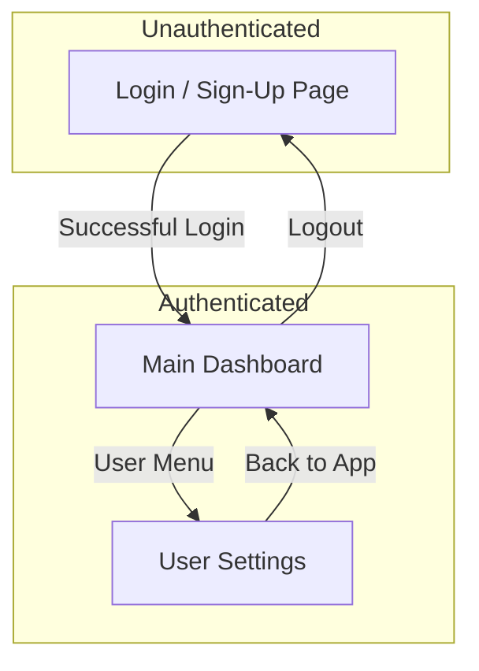
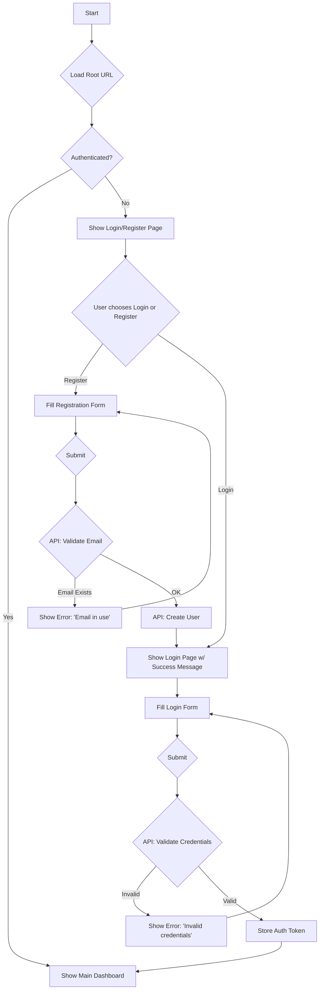
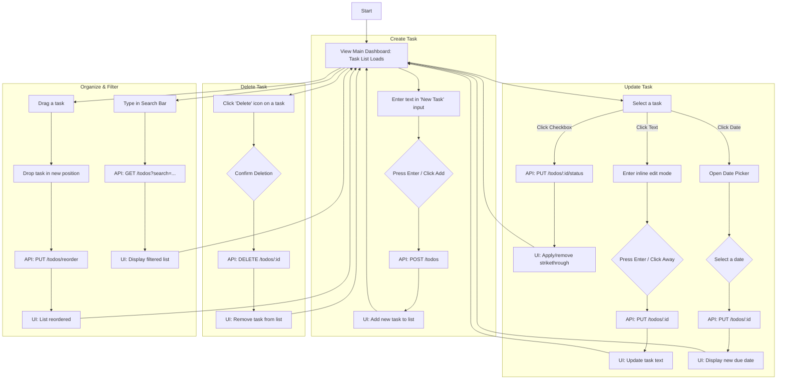

# Simple Todo UI/UX Specification

## Introduction

This document defines the user experience goals, information architecture, user flows, and visual design specifications for the Simple Todo application's user interface. It serves as the foundation for visual design and frontend development, ensuring a cohesive and user-centered experience.

### Overall UX Goals & Principles

#### Target User Personas
- **The Discerning Professional:** This user is a professional, creative, or student who values high-quality software and is willing to pay for a good user experience. They are organized, design-conscious, and wary of "subscription fatigue." They need a powerful, beautiful, and reliable tool and want to own it, not rent it.

#### Usability Goals
- **Ease of Learning:** A new user should be able to sign up and manage their core tasks (create, complete, delete) in under 5 minutes without instructions.
- **Efficiency of Use:** Frequent users should be able to manage their lists quickly through intuitive controls like drag-and-drop and in-line editing.
- **High Satisfaction:** The interface should feel fluid, responsive, and visually pleasing, contributing to a high user satisfaction score (NPS).

#### Design Principles
1.  **Clarity Above All:** The interface must be immediately understandable. Functionality should be clear and predictable.
2.  **Effortless Flow:** Users should be able to move through their tasks with minimal friction. Actions should require as few clicks/steps as possible.
3.  **Aesthetic Minimalism:** The design will be clean, modern, and uncluttered, ensuring the user's content is the primary focus.
4.  **Immediate Feedback:** Every user action—clicking a button, dragging a task, typing in search—must have a clear and immediate visual response.

### Change Log

| Date | Version | Description | Author |
| :--- | :--- | :--- | :--- |
| 2025-10-05 | 1.0 | Initial draft | Sally (UX) |

---

## Information Architecture (IA)

### Site Map / Screen Inventory
This diagram shows the primary screens of the application and the relationships between them.

### Navigation Structure

**Primary Navigation:**
Once a user is logged in, the primary navigation will be minimal. The main application header will contain a user avatar or icon that opens a small dropdown menu. This menu will provide access to "User Settings" and the "Logout" action.

**Secondary Navigation:**
Not applicable for the MVP. All core task management is handled directly within the main dashboard view.

**Breadcrumb Strategy:**
Not applicable for the MVP, as the application has a shallow, flat architecture where breadcrumbs are not necessary.

---

## User Flows

### User Authentication (Registration & Login)

**User Goal:** To securely access a personal workspace by either creating a new account or logging in with an existing one.

**Entry Points:** Visiting the application's root URL as an unauthenticated user.

**Success Criteria:** The user is successfully authenticated and lands on their personal "Main Dashboard."

#### Flow Diagram

#### Edge Cases & Error Handling:
- The user enters an invalid email format (e.g., missing "@"). The form should show inline validation feedback.
- The user enters a password that doesn't meet security requirements (if any are set).
- The API server is unavailable. The UI should show a generic error message like "Could not connect to the server."
- A "Forgot Password" flow is a critical edge case, but is noted as out of scope for the MVP.

**Notes:** This flow visualizes the complete authentication loop. Upon successful registration, the user is directed to the login page to complete the process, which provides clear feedback that their account has been created.

---

### Core Task Management

**User Goal:** To efficiently create, view, modify, organize, and delete tasks to keep track of work.

**Entry Points:** Viewing the Main Dashboard after successfully logging in.

**Success Criteria:** The user's task list accurately and quickly reflects all their changes, and they feel in complete control of their list.

#### Flow Diagram

#### Edge Cases & Error Handling:
- **Empty States:** The UI must gracefully handle the state where a user has no tasks or a search yields no results, showing a helpful message instead of a blank space.
- **Offline/API Errors:** If an API call fails (e.g., the user goes offline), the UI should revert the optimistic update and show a small, non-intrusive error notification (e.g., a toast message) indicating the change was not saved.
- **Input Validation:** The "New Task" input should not allow the creation of an empty or whitespace-only task.

**Notes:** This flow covers all the primary interactions on the dashboard. To achieve a fluid user experience, each action should result in an "optimistic" UI update first (the change appears instantly) before the API call completes.

---

## Wireframes & Mockups

**Primary Design Files:** High-fidelity mockups and prototypes will be created in a design tool like Figma. A link to the final design file will be placed here: `[Link to Figma Project]`

### Key Screen Layouts

#### Screen: Login & Registration
**Purpose:** To provide a secure and simple entry point for new and returning users.

**Key Elements:**
- Application Logo
- A clear heading indicating "Login" or "Sign Up".
- Tabs or links to easily switch between the Login and Sign Up forms.
- **Form Fields:**
    - Email Address Input
    - Password Input (with a show/hide toggle)
- **Action Buttons:**
    - A primary button for "Login" or "Sign Up".
- A subtle link for "Forgot Password?" (noted as a post-MVP feature).

**Interaction Notes:**
- Forms should have clear, persistent labels.
- Real-time, inline validation should provide feedback on errors (e.g., "Invalid email format") before the user submits the form.
- The page should be clean, focused, and free of distractions.

**Design File Reference:** `[Link to Figma Frame for Auth Screen]`

---

#### Screen: Main Dashboard
**Purpose:** To provide the primary workspace for users to view, create, and manage their tasks in a fluid and intuitive manner.

**Key Elements:**
- **Header:**
    - Application Logo/Name.
    - Search Bar for filtering tasks.
    - User Avatar/Menu in the top-right, which opens a dropdown for "Settings" and "Logout".
- **Content Area:**
    - A "New Task" input field, prominently placed at the top of the list.
    - The main Task List area, which is scrollable.
- **Individual Task Item (within the list):**
    - Checkbox for toggling completion status.
    - The task's text content (becomes an editable field on click).
    - Due date (if set), displayed in a subtle but clear way.
    - A drag handle icon.
    - A delete icon (e.g., an 'X'), visible on hover.

**Interaction Notes:**
- The list should feel alive, with smooth animations for adding, removing, and reordering tasks.
- Completed tasks should be visually de-emphasized (e.g., greyed out with a strikethrough) and possibly moved to a separate "Completed" area at the bottom of the list.
- Hovering over a task could reveal secondary actions like 'delete' to keep the default view clean.

**Design File Reference:** `[Link to Figma Frame for Main Dashboard]`

---

## Component Library / Design System

**Design System Approach:**
Given the project's use of Tailwind CSS, we will create a project-specific, utility-first component library. Instead of using a pre-built library like Material-UI, we will build our own set of reusable components (e.g., Buttons, Inputs) styled with Tailwind's utility classes. This approach provides maximum design flexibility while ensuring consistency and maintainability.

### Core Components

#### Component: Button
**Purpose:** To trigger all primary and secondary user actions.
**Variants:**
- **Primary:** Solid background, for the most important call-to-action on a page (e.g., "Login").
- **Secondary (Outline):** Transparent background with a colored border, for less critical actions.
- **Destructive:** Styled in a warning color (e.g., red) for actions that delete data.
**States:** Default, Hover, Focused, Disabled.
**Usage Guidelines:** Each view should ideally have only one Primary button.

---

#### Component: Input Field
**Purpose:** For all text entry, including login forms, the search bar, and the "New Task" input.
**Variants:** Standard, Search (with a leading search icon).
**States:** Default, Focused, Error (with a visible error message), Disabled.
**Usage Guidelines:** All input fields must have a clear, visible `<label>`.

---

#### Component: Task Item
**Purpose:** To display a single todo item in the main list. This is a composite component.
**Variants:** Default, Completed (styled with a strikethrough and muted colors).
**States:** Default, Hover (reveals secondary controls like the delete icon), Focused, Being Dragged (has a drop shadow and lifts off the page).
**Usage Guidelines:** This is the most critical component in the UI. Its clarity and ease of interaction are paramount.

---

#### Component: Dropdown Menu
**Purpose:** To house a list of actions or links in a contextual menu, such as the user profile menu.
**Variants:** N/A.
**States:** Open, Closed.
**Usage Guidelines:** Use for important but non-primary actions to avoid cluttering the main interface.

---

#### Component: Modal / Dialog
**Purpose:** To confirm critical actions or display important information that interrupts the user's flow.
**Variants:** Confirmation (e.g., "Are you sure you want to delete?"), Information.
**States:** Open, Closed.
**Usage Guidelines:** Use sparingly, only for critical actions like data deletion, to avoid disrupting the user experience.

---

## Branding & Style Guide

### Visual Identity
**Brand Guidelines:** No formal brand guidelines exist for this project. This document will serve as the foundational style guide. The overall aesthetic should be minimalist, clean, and modern, drawing inspiration from design-forward applications like Airbnb and Linear.

### Color Palette
The palette is designed to be professional, calm, and accessible, with a clear system for communicating information. We will use colors from the Tailwind CSS palette for easy implementation.

| Color Type | Hex Code (Example) | Usage |
| :--- | :--- | :--- |
| Primary | `#1e293b` (Slate 800) | Main headers, primary buttons, key UI elements. |
| Secondary | `#475569` (Slate 600) | Secondary text, borders, less important elements. |
| Accent | `#0ea5e9` (Sky 500) | Focus indicators, highlights, selected items. |
| Success | `#22c55e` (Green 500) | Confirmation messages, success states. |
| Warning | `#f59e0b` (Amber 500) | Cautions, important notices. |
| Error | `#dc2626` (Red 600) | Error messages, destructive action buttons. |
| Neutral | `Slate` Palette | Used for text, borders, and backgrounds in various shades. |

### Typography

#### Font Families
- **Primary:** **Inter**. A clean, highly readable sans-serif font that works well for UI design. It will be sourced from Google Fonts.
- **Monospace:** The system's default monospace font (e.g., Menlo, Consolas) for any code-related text.

#### Type Scale
We will use a harmonious and responsive type scale based on `rem` units for accessibility. (Values are examples based on Tailwind's defaults).

| Element | Size | Weight | Line Height |
| :--- | :--- | :--- | :--- |
| H1 | 2.25rem (36px) | Bold | 2.5rem |
| H2 | 1.875rem (30px) | Bold | 2.25rem |
| H3 | 1.5rem (24px) | Bold | 2rem |
| Body | 1rem (16px) | Normal | 1.5rem |
| Small | 0.875rem (14px) | Normal | 1.25rem |

### Iconography
**Icon Library:** **Heroicons**. This library is designed by the makers of Tailwind CSS, ensuring perfect visual and technical integration. We will use the "Outline" style for a light, modern feel.
**Usage Guidelines:** Icons should be used to reinforce meaning, not as pure decoration. They should always be paired with text labels unless the meaning is universally understood (e.g., a trash can for delete).

### Spacing & Layout
**Grid System:** We will use Tailwind's flexible grid system for all layouts.
**Spacing Scale:** All margins, padding, and gaps will use Tailwind's default spacing scale. This ensures consistent, rhythmic spacing throughout the application.

---

## Accessibility Requirements

### Compliance Target
**Standard:** **WCAG 2.1 Level AA**. All design and development work must adhere to this standard.

### Key Requirements

#### Visual
- **Color Contrast:** All text must have a contrast ratio of at least **4.5:1** against its background. Large text (18pt or 14pt bold) must have a ratio of at least **3:1**.
- **Focus Indicators:** All interactive elements (links, buttons, inputs) must have a clear and highly visible focus indicator when navigated to via a keyboard. Our chosen Accent color is a good candidate for this.
- **Text Sizing:** The application must be fully readable and functional when the browser's zoom level is increased to 200%.

#### Interaction
- **Keyboard Navigation:** All functionality must be achievable using only a keyboard. The tab order through interactive elements must be logical and predictable.
- **Screen Reader Support:** We will use semantic HTML5 (e.g., `<nav>`, `<main>`, `<button>`) and appropriate ARIA (Accessible Rich Internet Applications) attributes to ensure the UI can be correctly interpreted by screen readers.
- **Touch Targets:** On touch devices, all interactive elements must have a minimum target size of 44x44 CSS pixels to be easily tappable.

#### Content
- **Alternative Text:** All meaningful images (like a user's avatar) must have descriptive `alt` text. Images that are purely decorative must have an empty `alt=""` attribute.
- **Heading Structure:** Page content must use a logical and hierarchical heading structure (`<h1>`, `<h2>`, `<h3>`, etc.) to facilitate navigation.
- **Form Labels:** All form inputs must have a programmatically associated `<label>` that is always visible.

### Testing Strategy
Accessibility will be tested throughout the development process using a combination of methods:
1.  **Automated Testing:** Integrating tools like `axe-core` into our development workflow to catch common violations automatically.
2.  **Manual Keyboard Testing:** Regularly navigating the application using only the Tab, Shift+Tab, Enter, and Space keys.
3.  **Manual Screen Reader Testing:** Periodically testing key user flows with a screen reader (e.g., NVDA, VoiceOver, or JAWS).

---

## Responsiveness Strategy

### Breakpoints
We will use a standard, mobile-first set of breakpoints that align with common device sizes. These breakpoints correspond to Tailwind CSS's default screen sizes for seamless implementation.

| Breakpoint | Min Width | Target Devices |
| :--- | :--- | :--- |
| Mobile | 0px | Phones |
| Tablet | 768px | Tablets, small laptops |
| Desktop | 1024px | Standard desktop monitors |
| Wide | 1280px | Large desktop monitors |

### Adaptation Patterns

**Layout Changes:**
- **Mobile:** The application will use a single-column layout. The task list and all controls will be vertically stacked to be easily scrollable and usable with one hand.
- **Tablet & Desktop:** The layout will remain a single, focused column for the task list, but with more generous white space and potentially a wider central column. The overall layout will not fundamentally change, preserving a consistent experience.

**Navigation Changes:**
- The primary user menu (avatar dropdown) will remain consistent across all breakpoints.
- On the smallest mobile screens, the Search Bar in the header may be collapsed into a search icon that, when tapped, expands the input field.

**Content Priority:**
- On all screen sizes, the user's task list is the primary content and will always be the focus of the viewport. The "New Task" input will remain at the top and immediately accessible.

**Interaction Changes:**
- **Hover vs. Tap:** Interactions that rely on `hover` on desktop (like revealing the delete icon on a task) will be adapted for touch. On mobile, the delete icon will be persistently visible on each task item to ensure it's tappable.
- **Touch Targets:** As defined in the Accessibility section, all touch targets will be at least 44x44px.

---

## Animation & Micro-interactions

### Motion Principles
Our use of animation will be guided by the following principles, and implemented using the **Framer Motion** library as specified in the technical requirements.

- **Responsive & Fast:** Animations must be quick (generally 200-300ms) and feel like a direct response to user input. The goal is a snappy, not sluggish, interface.
- **Functional, Not Frivolous:** Motion should always serve a purpose, such as guiding attention, providing feedback on an action, or illustrating a change in the UI's state.
- **Natural Easing:** We will use "ease-out" easing curves for most animations. This makes motion feel natural and physical, starting fast and gently slowing to a stop.

### Key Animations

- **Task Add/Remove:** When a new task is added, it will fade in and slide down into its position in the list. When deleted, it will fade out while its height collapses, and the items below will smoothly animate upwards to fill the space. (Duration: 250ms, Easing: Ease-out)
- **Task Reordering:** During drag-and-drop, the dragged item will lift with a subtle shadow. As it moves, other items in the list will smoothly animate to make space. When dropped, the item will animate into its final position. (Duration: 150ms, Easing: Ease-in-out)
- **Completion Toggle:** When a task's checkbox is toggled, the strikethrough on the text will animate across, and the item's color will subtly fade to its "completed" state. (Duration: 200ms, Easing: Ease-out)
- **Focus & Hover States:** Interactive elements like buttons, inputs, and tasks will have a quick, subtle transition on their background color or shadow when hovered or focused, providing immediate feedback. (Duration: 100ms, Easing: Linear)
- **Page Transitions:** A gentle cross-fade animation will be used when transitioning between the login/authentication pages and the main dashboard. (Duration: 300ms, Easing: Ease-in-out)

---

## Performance Considerations

### Performance Goals
To ensure a high-quality user experience, we will adhere to the following performance budget:

- **Page Load:** The application's initial load time (measured by Largest Contentful Paint - LCP) should be **under 2.5 seconds** on a standard internet connection.
- **Interaction Response:** As specified in the PRD, feedback from any user interaction (clicking, dragging, typing) must be provided in **under 100ms**, making the UI feel instantaneous.
- **Animation FPS:** All animations and transitions must maintain a consistent **60 frames per second (FPS)** to feel smooth and fluid.

### Design Strategies
The following strategies will be employed in design and development to meet our performance goals:

- **Optimistic UI Updates:** For actions like creating, updating, or deleting tasks, the UI will update immediately, assuming the API call will be successful. This makes the application feel incredibly fast. An error state will be handled if the API call subsequently fails.
- **Code Splitting:** The application's JavaScript will be split by route. This means the code for the main dashboard will not be loaded until after the user successfully logs in, keeping the initial bundle size small and load times fast.
- **Asset Optimization:** All static assets (images, fonts) will be compressed and served in modern formats. We will implement caching policies to ensure returning visitors have a near-instantaneous load experience.
- **Efficient Component Rendering:** Frontend components will be built to avoid unnecessary re-renders, ensuring the UI remains snappy even with a large number of tasks on the screen.

<!-- ---

## Next Steps

### Immediate Actions
1.  Share this UI/UX Specification with all project stakeholders (Product, Engineering) for final review and approval.
2.  Begin creating high-fidelity visual designs and prototypes in a design tool (e.g., Figma) based on the wireframes and style guide defined in this document.
3.  Prepare for a handoff meeting with the Design Architect and development team to walk through this specification and answer any questions.

### Design Handoff Checklist
- [x] All user flows documented
- [x] Component inventory complete
- [x] Accessibility requirements defined
- [x] Responsive strategy clear
- [x] Brand guidelines incorporated
- [x] Performance goals established

--- -->

## Checklist Results
_(No UI/UX checklist is currently configured for this agent to run. This section is intentionally left blank)._
